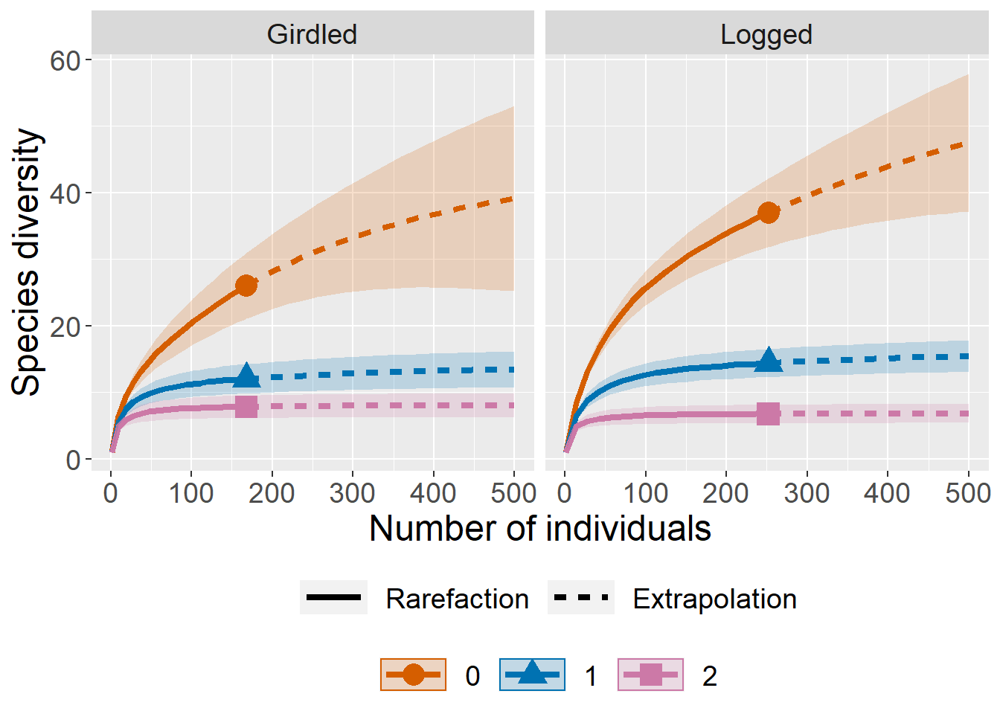
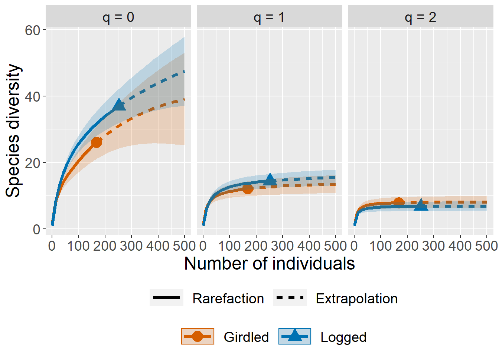
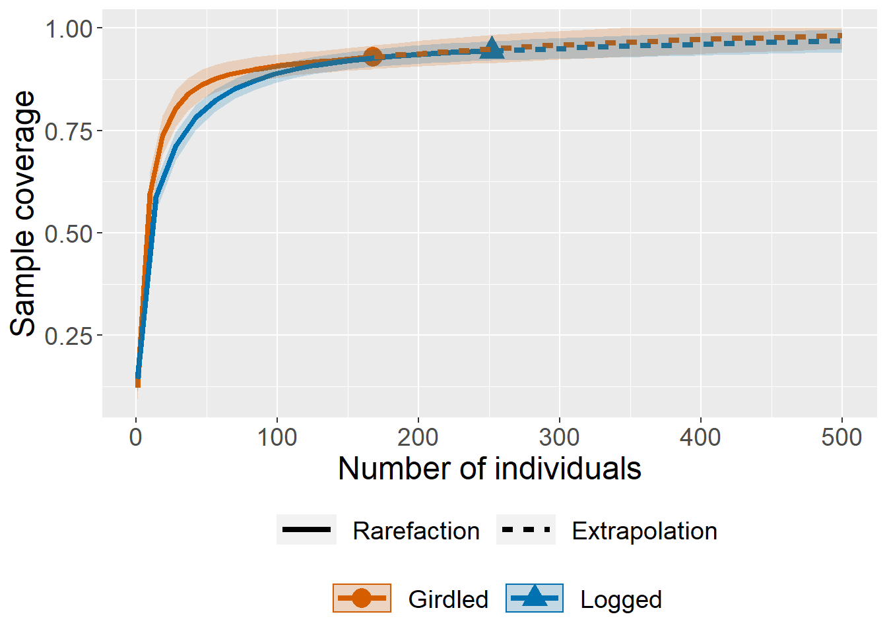
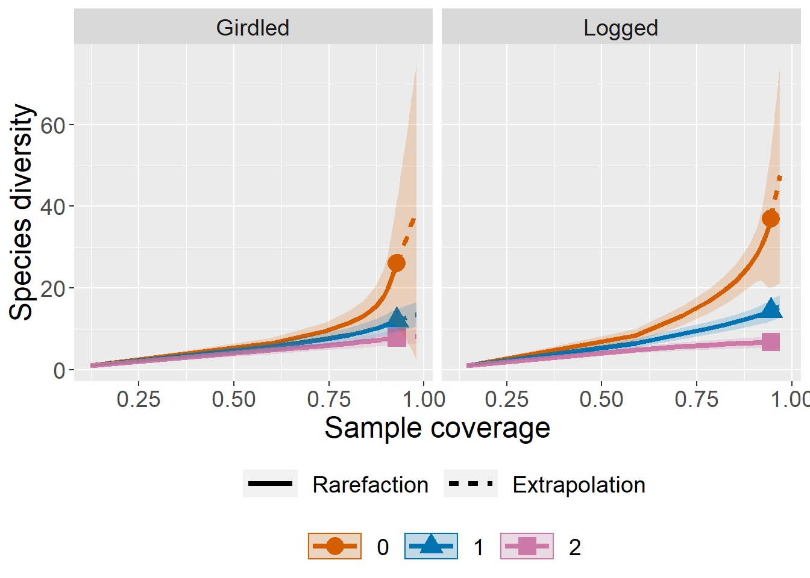
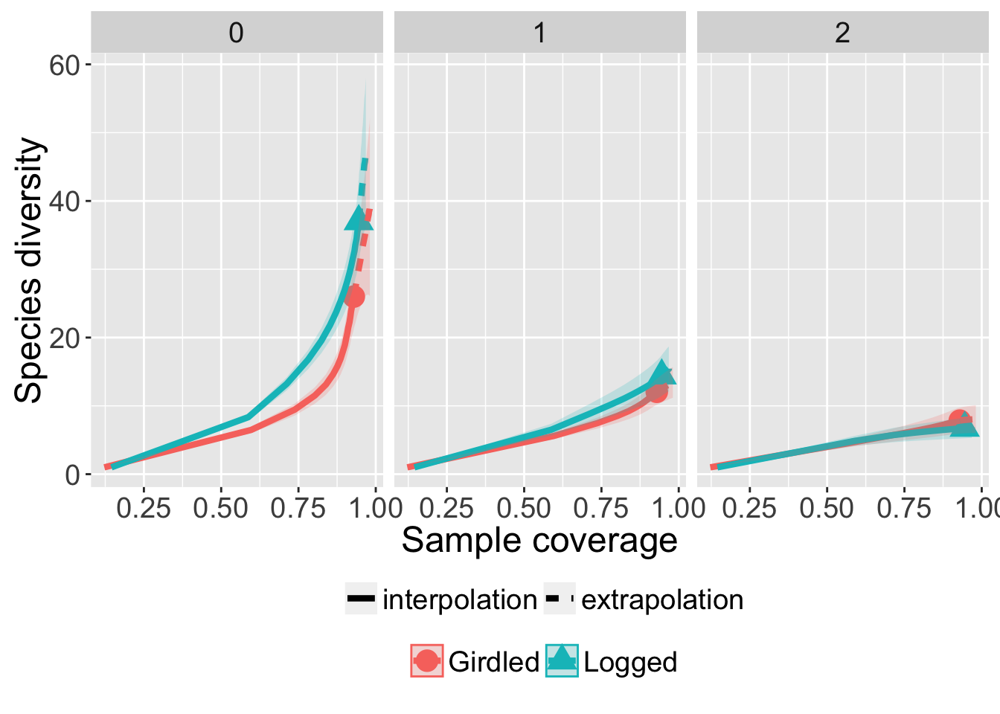
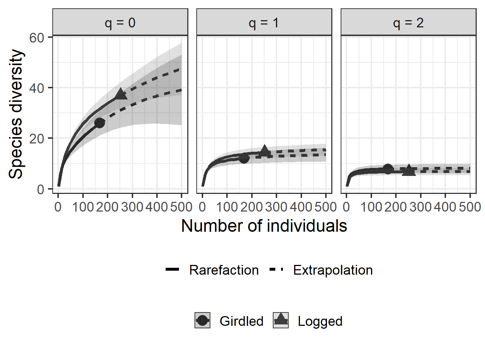
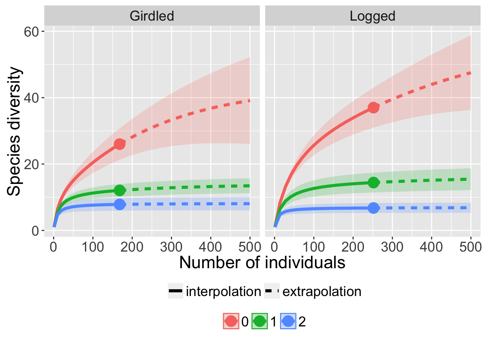

<!-- README.md is generated from README.Rmd. Please edit that file -->
iNEXT (R package)
=================

[](https://travis-ci.org/JohnsonHsieh/iNEXT) [](https://github.com/metacran/cranlogs.app)

<h4 style="text-align: right;">
Most recent update time: March 19, 2016

A Quick Introduction to iNEXT: An R Package for Interpolation and Extrapolation of Hill Numbers by
</h4>
<h5>
Hsieh, T. C., K. H. Ma, and Anne Chao

Institute of Statistics, National Tsing Hua University, Hsin-Chu, Taiwan 30043
</h5>
iNEXT (iNterpolation and EXTrapolation) is an R package modified from the original version supplied in the Supplement of Chao et al. (2014). In this updated version, we have added more user-friendly features and refined the graphic displays. Please notice the updated time and replace your old version by the most recent one. In this document, we provide a quick introduction to show how to run iNEXT. Detailed information about iNEXT functions is provided in [iNEXT Manual](http://chao.stat.nthu.edu.tw/blog/wp-content/uploads/2014/01/iNEXT-manual.pdf) which is also available in [CRAN](cran.r-project.org/web/packages/iNEXT/index.html). Examples/details are also included in an application paper by Hsieh et al. (2015).

To run iNEXT, the user supplies a matrix, data.frame (species by sites), or list of species abundances or incidence frequencies (called reference sample). If datatype = ?€œincidence", then the first entry of the input data must be total number of sampling units in each column or list. iNEXT focuses on three measures of Hill numbers of order q: species richness (q = 0), Shannon diversity (q = 1, exponential of Shannon entropy) and Simpson diversity (q = 2, inverse of Simpson concentration). For each diversity measure, iNEXT computes the following two types of rarefaction (interpolation) and extrapolation (prediction) and the associated 95% confidence intervals:

1.  Sample-size-based rarefaction and extrapolation: diversity estimates for rarefied and extrapolated samples up to a maximum size (double reference sample size by default or a user-specified endpoint); see below.
2.  Coverage-based rarefaction and extrapolation: diversity estimates for rarefied and extrapolated samples for sample coverage up to a maximum coverage that is obtained from the double reference sample size by default or a user-specified endpoint; see below).

iNEXT also plots the following three integrated sampling curves suggested in Chao et al. (2014) for species diversity analysis.

-   Sample-size-based rarefaction and extrapolation sampling curve: this curve plots the diversity estimates with respect to sample size up to a maximum size (described above) by the following commands:

``` r
plot(object.iNEXT, type=1) # S3 method
ggiNEXT(object.iNEXT, type=1) # ggplot2 method
```

-   Sample completeness curve: this curve plots the sample completeness (as measured by sample coverage) with respect to sample size up to a maximum size described above. The curve provides a bridge between sample-size- and coverage-based rarefaction and extrapolation using the following commands:

``` r
plot(object.iNEXT, type=2) # S3 method
ggiNEXT(object.iNEXT, type=2) # ggplot2 method
```

-   Coverage-based rarefaction and extrapolation sampling curve: this curve plots the diversity estimates with respect to sample coverage up to a maximum coverage described above using the following commands:

``` r
plot(object.iNEXT, type=3) # S3 method
ggiNEXT(object.iNEXT, type=3) # ggplot2 method
```

### SOFTWARE NEEDED TO RUN INEXT IN R

-   Required: [R](http://cran.rstudio.com/)
-   Suggested: [RStudio IDE](http://www.rstudio.com/ide/download/)

### HOW TO RUN INEXT:

Start R(Studio) and copy-and-paste the following commands into R Console:

``` r
## install iNEXT package from CRAN
install.packages("iNEXT")

## install the latest version from github
install.packages('devtools')
library(devtools)
install_github('JohnsonHsieh/iNEXT')
library(iNEXT)
```

Remark: In order to install `devtools` package, you should update R to the last version. Further, to get `install_github` to work, you should install the `httr` package.

### EXAMPLE

Two data sets (spider for abundance data and ant for incidence data) are included in iNEXT package. See Chao et al. (2014) for analysis details and data interpretations. Here we just demonstrate the implementation of iNEXT to obtain plots. We first use the spider data for demonstration. The spider data consist of abundance data from two canopy manipulation treatments (Girdled and Logged) of hemlock trees (Ellison et al. 2010). To obtain plots, copy-and-paste the following commands into R Console:

``` r
data(spider)
out <- iNEXT(spider, q=c(0, 1, 2), datatype="abundance", endpoint=500)
ggiNEXT(out, type=1, facet.var="site")
ggiNEXT(out, type=1, facet.var="order", color.var="site")

## Not run:
# display black-white theme
ggiNEXT(out, type=1, facet.var="order", grey=TRUE)

# S3 method for class 'iNEXT'
plot(out, type=1)
## End(Not run)
```

The argument `facet.var="site"` in ggiNEXT function creates a separate plot for each site as shown below:

<!-- -->

The argument `facet.var="order"` and `color.var = ?€œsite"` creates a separate plot for each diversity order site, and within each plot, different colors are used for two sites.

``` r
ggiNEXT(out, type=1, facet.var="order", color.var="site")
```

<!-- -->

The following commands returns the sample completeness curve in which different colors are used for the two sites:

``` r
ggiNEXT(out, type=2, facet.var="none", color.var="site")
```

<!-- -->

``` r
ggiNEXT(out, type=3, facet.var="site")
ggiNEXT(out, type=3, facet.var="order", color.var="site")
```

<!-- --><!-- -->

### Hacking ggiNEXT

``` r
# display black-white theme
ggiNEXT(out, type=1, facet.var="order", grey=TRUE)
```

<!-- -->

``` r
# free the scale of axis
ggiNEXT(out, type=1, facet.var="order") + 
  facet_wrap(~order, scales="free")
```

<!-- -->

``` r
# change the shape of reference sample size
ggiNEXT(out, type=1, facet.var="site") + 
  scale_shape_manual(values=c(19,19,19))
```

<!-- -->

### How to cite

If you use iNEXT to obtain results for publication, you should cite at least one of the relevant papers (Chao and Jost 2012; Colwell et al. 2012; Chao et al. 2014) along with the following reference for iNEXT:

> Hsieh, T. C., K. H. Ma, and A. Chao. 2016. iNEXT: An R package for rarefaction and extrapolation of species diversity (Hill numbers). <http://chao.stat.nthu.edu.tw/blog/software-download> Methods in Ecology and Evolution (in revision).

### Vignettes

-   [A Quick Introduction to iNEXT via Examples](http://johnsonhsieh.github.io/iNEXT/inst/doc/Introduction.html)

``` r
vignette("introduction",package="iNEXT")
```

-   [Customize Plots and Graphics](http://johnsonhsieh.github.io/iNEXT/inst/doc/graphics.html)

``` r
vignette("graphics",package="iNEXT")
```

### License

The iNEXT package is licensed under the GPLv3. To help refine iNEXT, your comments or feedbacks would be welcome (please send them to [Anne Chao](chao@stat.nthu.edu.tw)).

### Referance

1.  Chao, A., N. J. Gotelli, T. C. Hsieh, E. L. Sander, K. H. Ma, R. K. Colwell, and A. M. Ellison 2014. Rarefaction and extrapolation with Hill numbers: a unified framework for sampling and estimation in biodiversity studies, Ecological Monographs 84:45-67.
2.  Chao, A., and L. Jost. 2012. Coverage-based rarefaction and extrapolation: standardizing samples by completeness rather than size. Ecology 93:2533-2547.
3.  Colwell, R. K., A. Chao, N. J. Gotelli, S. Y. Lin, C. X. Mao, R. L. Chazdon, and J. T. Longino. 2012. Models and estimators linking individual-based and sample-based rarefaction, extrapolation and comparison of assemblages. Journal of Plant Ecology 5:3-21.
4.  Ellison, A. M., A. A. Barker-Plotkin, D. R. Foster, and D. A. Orwig. 2010. Experimentally testing the role of foundation species in forests: the Harvard Forest Hemlock Removal Experiment. Methods in Ecology and Evolution 1:168-179.
5.  Hsieh, T. C., K. H. Ma, and A. Chao. 2013. iNEXT online: interpolation and extrapolation (Version 1.3.0) \[Software\]. Available from <http://chao.stat.nthu.edu.tw/blog/software-download/>.
6.  Hsieh T. C., K. H. Ma, and A. Chao. 2014. iNEXT: An R package for interpolation and extrapolation of species diversity (Hill numbers). Submitted manuscript.
7.  Longino, J. T., and R. K. Colwell. 2011. Density compensation, species composition, and richness of ants on a neotropical elevational gradient. Ecosphere 2:art29.
